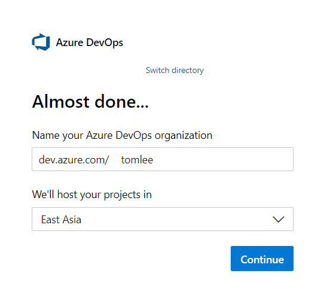
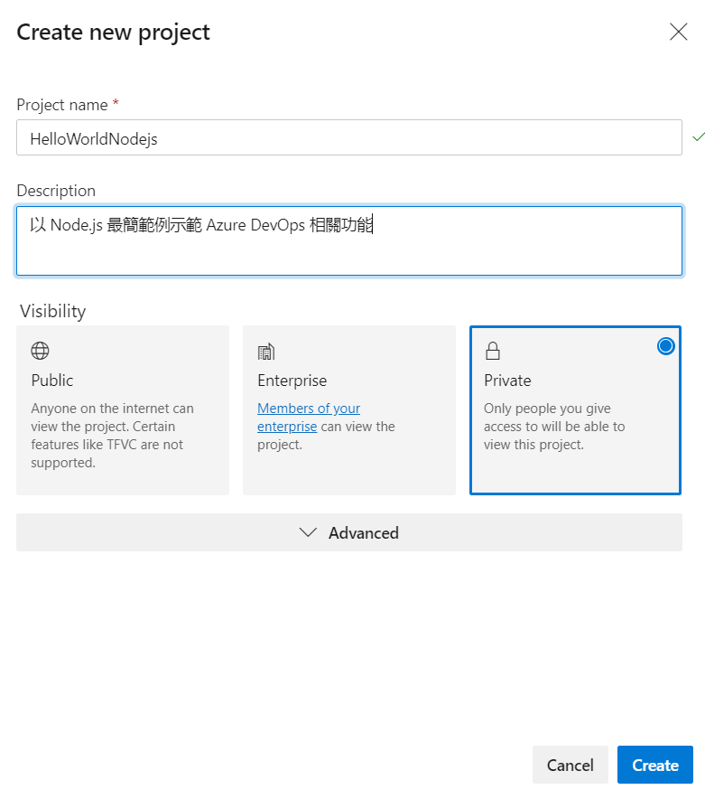
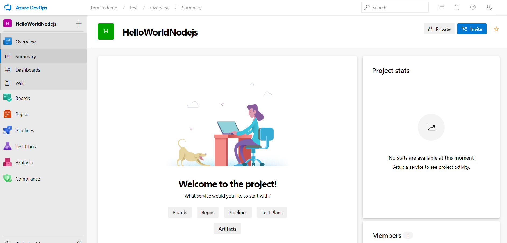

# Azure DevOps 持續整合/持續交付 (CI/CD,Continuous Integration Continuous Delivery) 功能實機操作

## Lab 1 在 Azure DevOps 內建立組織 (Organization) 與專案 (Project)
1.當您已經擁有 Azure DevOps 免費帳號之後，請以瀏覽器登入 https://dev.azure.com/ 進入 Azure DevOps 入口管理網站。

2.請如圖點選左下角準備建立組織 (Organization)，一個組織底下允許有多個專案 (Project) 作為開發與維運團隊共同合作的標的。

如圖所示，在建立組織時必須指定一個名稱並選擇所在的資料中心位置，未來組織名稱會是 Azure DevOps 入口管理網站 URL 的一部分。

3.當組織建立完畢之後，如圖點選右上方準備建立實作練習使用的專案 (Project) 

如圖所示，在建立專案時必須指定一個名稱，未來組織名稱加上專案名稱會是 Azure DevOps 入口管理網站 URL 的一部分。您也可以為此專案加上些描述性的文句，以幫助專案團隊成員了解此專案目的。建立專案時有三種類型，若選擇公開類型專案 (**Public**) 所有人都可在 Internet 上瀏覽您的專案，選擇企業類型專案 (**Enterprise**) 則微軟確保 Azure DevOps 提供 99.9 不停機服務水準保證，且需透過 Azure AD 進行身分驗證方可檢視此專案，由於這是付費版本 Azure DevOps 才提供的功能，免費帳號是無法建立的，而選擇私有類型專案 (**Private**) 則只有被您加入組織的登入帳號才允許瀏覽，在本次實機練習請如圖選則私有 (**Private**) 類型專案，請建立一個名為 HelloWorldNodejs 的專案。如圖按下右下角 **Create** 按鈕後即會開始建立專案。

4.當瀏覽器出現如下畫面代表已經順利建立完成專案，Lab 1 已經完成。

* [前往練習 Lab 2](Labs-02.md)
* [返回 README](README.md)