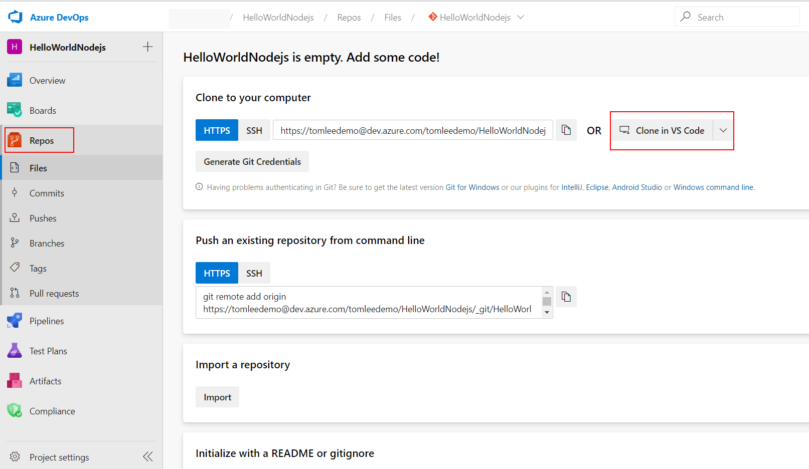
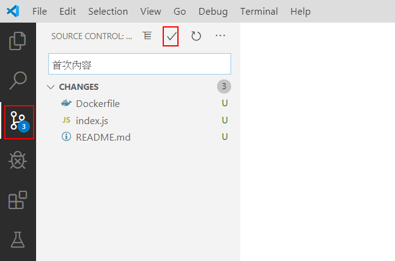
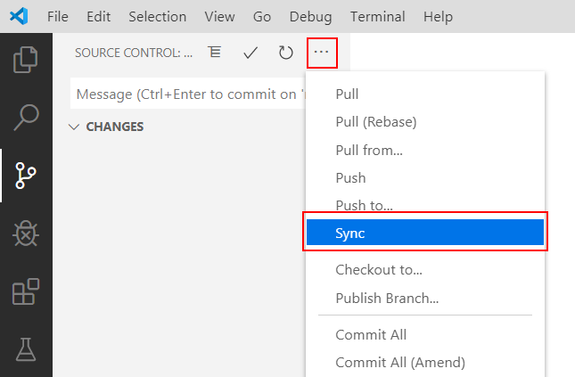
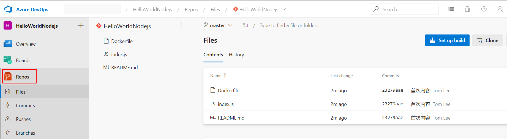

# Azure DevOps 持續整合/持續交付 (CI/CD,Continuous Integration Continuous Delivery) 功能實機操作


## Lab 2 Azure DevOps 內建立儲存庫 (Repos) 並加入程式碼
1.請以瀏覽器登入 https://dev.azure.com/ 進入 Azure DevOps 入口管理網站，並如圖點選左方的儲存庫 (**Repos**)， Repos 是儲存庫 Repository 的縮寫，您可以放置專案中所有需要被版本控管的內容，通常是程式碼、組態設定檔或是專案文件。Azure DevOps Repos 與知名的 GitHub 都是在雲端由微軟公司所管理的 Git 伺服器，用戶可以透過標準的 Git 命令列工具、支援 Git 之編輯器或是網頁介⾯來操作。由於此專案剛建立完成，還沒有任何儲存庫被建立，我們可以 :
* **Clone to your computer** 將儲存庫複製一份到您的電腦
* **Push an existing repository from command line** 將一個已經存在的資料夾透過 Git 命令列工具複製至此儲存庫
* **Import a repository** 從其他 Git 儲存庫匯入到此儲存庫

而畫面最下方，按下 **Initialize with README or gitignore** 相關按鈕，則會幫此儲存庫自動產生妥 REAME.md 說明檔案與忽略不需要被版本管理的檔案清單 .gitignore。

本次實機練習，我們以最簡單的方式，點選圖片右方 **Clone in VS Code** 按鈕，即可自動啟動 Windows 10 內安裝妥的 Visual Studio Code，當您在 Visual Studio Code 內選妥本機的一個資料夾之後，Visual Studio Code 便會將此空的儲存庫複製一份在您的電腦中。


2.您可以利用 Visual Studio Code 在複寫下來的 HelloWorldNodejs 資料夾內建立一個名為 index.js 檔案如下，亦可以[直接下載預先備妥之檔案使用](HelloWorldNodejs/index.js)

```javascript
const http = require("http");
const os = require("os");

const ipv4 = "0.0.0.0";
const port = 9876;
const computerName = os.hostname();

const server = http.createServer((req, res) => {
  res.statusCode = 200;
  res.setHeader("Content-Type", "text/html");  
  res.write("<h1>Hello World! </h1>");
  res.write("from "+computerName);
  res.end();
});

server.listen(port, ipv4, () => {
  console.log(`Server running at http://${ipv4}:${port}/`);
});
```
3.命令列模式下，在 HelloWorldNodejs 資料夾內鍵入如下命令，確認一個網頁伺服器已經如下圖順利執行，並於 Port 9876 上準備接收 HTTP 請求

```powershell
node index.js
```

4.開啟瀏覽器連線至本機 http://localhost:9876 測試此 Nodejs 網頁應用程式，預期順利執行會回傳 Hello World 字樣網頁，而畫面中則該顯示您的電腦名稱。

5.命令列模式下鍵入 Ctrl-C 終止 node index.js 之執行，此時開啟瀏覽器連線至本機 http://localhost:9876 將無法順利顯示網頁

6.在 HelloWorldNodejs 資料夾中以 Visual Studio Code 編輯器建立一個名為 Dockerfile 的檔案如下，亦可以[直接下載預先備妥之檔案使用](HelloWorldNodejs/Dockerfile)

```dockerfile
# 由 Docker Hub 官方版本 node:12 映像檔為基礎
FROM node:12

# 建立應用程式所在目錄
WORKDIR /usr/src/app

# 複製目前程式
COPY . .

# 開放 Port
EXPOSE 9876

# 容器執行即自動執行 node index.js
CMD [ "node", "index.js" ]
```

7.在命令列模式下，在 HelloWorldNodejs 資料夾內鍵入如下命令，開始建立此應用程式之 Docker 映像檔，並且以 nodejs-app:0.1 作為這個映像檔版本辨識用的標籤
```powershell
docker build -t nodejs-app:0.1 .
```

8.在命令列模式下，鍵入如下命令確認映像檔已經順利建立完成。
```powershell
docker images
```

應會顯示類似如下結果 :

| REPOSITORY  | TAG    | IMAGE ID     | CREATED       | SIZE   |
|-------------|--------|--------------|---------------|--------|
| nodejs-app | 0.1 | 148ab6e0b173 | 14 seconds ago | 913MB |

9.在命令列模式下，鍵入如下命令建立容器，能夠在背景執行狀況下於 Port 9999 上準備接收 HTTP 請求
```powershell
docker run -d -p 9999:9876 nodejs-app:0.1 
```
10.開啟瀏覽器連線至此容器 http://localhost:9999 測試此 Nodejs 網頁應用程式，預期順利執行會回傳 Hello World 字樣網頁，如果鍵入以下指令
```powershell
docker ps
```

| CONTAINER ID | IMAGE   | COMMAND                | CREATED       | STATUS | PORTS                              | NAMES          |
|--------------|---------|------------------------|---------------|--------|------------------------------------|----------------|
| 66f8280f7650 | nodejs-app:0.1 | "docker-entrypoint.s…" | 2 minutes ago |  Up 35 seconds | 0.0.0.0:9999 ->9876/tcp | reverent_haibt |

我們也可發現 Nodejs 程式所取得的電腦名稱與 CONTAINER ID 會相符。

11.在命令列模式下執行以下命令，停止容器執行並刪除容器
```powershell
docker rm <CONTAINER ID> -f
```
此時開啟瀏覽器連線至本機 http://localhost:9999 將無法順利顯示網頁。至此代表開發中的應用程式已經可以順利在本機 Windows 10 的容器環境中執行，我們即將把程式碼存放至本機的 Git 儲存庫以及雲端的 Azure DevOps Repo 儲存庫。

12.如圖請在 Visual Studio Code 內點選版本管控 (Source Control) 圖示，可以看到我們所建立的 Nodejs 應用程式 index.js 與 Dockerfile 等檔案，我們可以在文字方塊內輸入 "首次內容" 作為註解，接著按下 **✓** Commit 符號即可將相關檔案納入本機 Git 儲存庫的管理。Visual Studio Code 對於 Commit 操作預設是合併了 git add 與 git commit 兩個動作，對初學者而言是比較簡單。



13.如圖請在 Visual Studio Code 內點選版本管控 (Source Control) 圖示，接著按下 **....** 符號顯示更多操作之選單，在選端單點選 **Sync** 即開始本機與雲端 Azure DevOps Repos 儲存庫間進行檔案同步，等於在命令列下達 git sync 是一樣的。



14.當 Visual Studio Code 檔案同步完成，我們再次以瀏覽器登入 https://dev.azure.com/ 進入 Azure DevOps 入口管理網站，並如圖點選左方的儲存庫 (**Repos**)，即可確認相關檔案已經同步到雲端了。



* [前往練習 Lab 3](Labs-03.md)
* [返回 README](README.md)