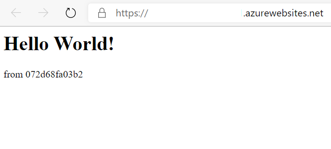
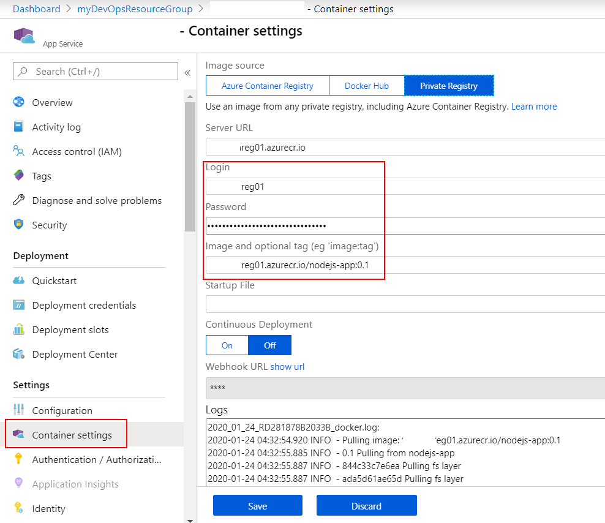

# Azure DevOps 持續整合/持續交付 (CI/CD,Continuous Integration Continuous Delivery) 功能實機操作

## Lab 4 建立 Azure Web App for Containers Linux 手動佈署容器

1.要建立 Azure Web App for Containers Linux 之前，我們必須先建立妥 App Service Plan。建立的 App Service Plan 會定義 Azure Web App for Containers 所需之運算資源。我們將運用 Lab 3 已經建立的資源群組 myDevOpsResourceGroup 在命令列模式下達以下命令，將在東南亞機房建立一個名為 mydevops-appserviceplan 的 App Service Plan，此計畫中會包含一個基本層級 B1 等級的 Linux 執行個體。

```powershell
az appservice plan create -n mydevops-appserviceplan -g myDevOpsResourceGroup --is-linux -l southeastasia --sku B1 --number-of-workers 1
```

2.在命令列模式下達以下命令，依據之前所建立的 mydevops-appserviceplan 建立一個 Azure Web App for Continers，請指定一個絕對唯一個名稱作為的 Azure Web App 名稱，此名稱將為未來網域名稱的的一部分，因此這個名稱須符合 DNS 所允許的字元，英文字母也不會區分大小寫，請將在 Lab 3 時所記錄的 Azure Container Registry 相關資訊填入。

```powershell
az webapp create -n <Azure Web App 名稱> -p mydevops-appserviceplan -g myDevOpsResourceGroup -i <ACR 名稱>.azurecr.io/nodejs-app:0.1 -s <ACR 管理帳號> -w <ACR 管理密碼>
```

由於 Azure Web App 僅允許透過 80 與 443 兩個 TCP Port 存取使用，而我們在 Lab 2 所建立的 Docker 映像檔則是從 Port 9876 輸出，因此我們必須以如下命令，告知 Azure Web App 容器對外輸出的 Port 為 9876。

```powershell
az webapp config appsettings set -n <Azure Web App 名稱> -g myDevOpsResourceGroup --settings WEBSITES_PORT=9876
```

3.以瀏覽器連接網址 https://<Azure Web App 名稱>.azurewebsites.net/ 進行測試，由於第一次瀏覽器瀏覽此網址時 Azure Web App for Containers Linux 才開始從 Azure Container Registry 拉取 Docker 映像檔，為了節費 B1 等級也非速度快的運算等級，因此第一次執行需要比較長的時間，第一次執行可能會出現 HTTP 502 或 HTTP 500 的錯誤訊息，這些都是容器尚未載入完成所產生的暫時錯誤，請稍後重新整理瀏覽器即可看到如下順利執行的畫面 :



4.我們可用瀏覽器進入 [Azure Portal](https://portal.azure.com) 如下圖進入所建立的 Azure Web App for Containers Linu 點選 **Container settings**，即可看見之前 CLI 命令所建立與設定之內容。


 
請保留本 Lab 所建立之環境，並記錄

* Azure Web App 名稱

以供後續 Lab 使用。

* [前往練習 Lab 5](Labs-05.md)
* [返回 README](README.md)
