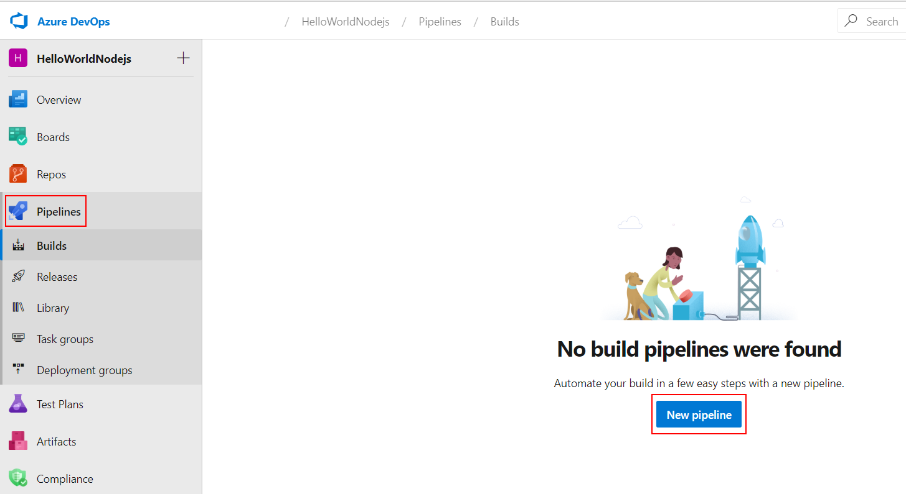
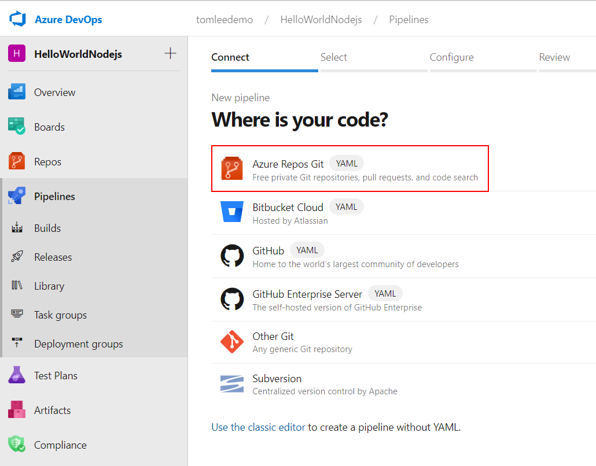
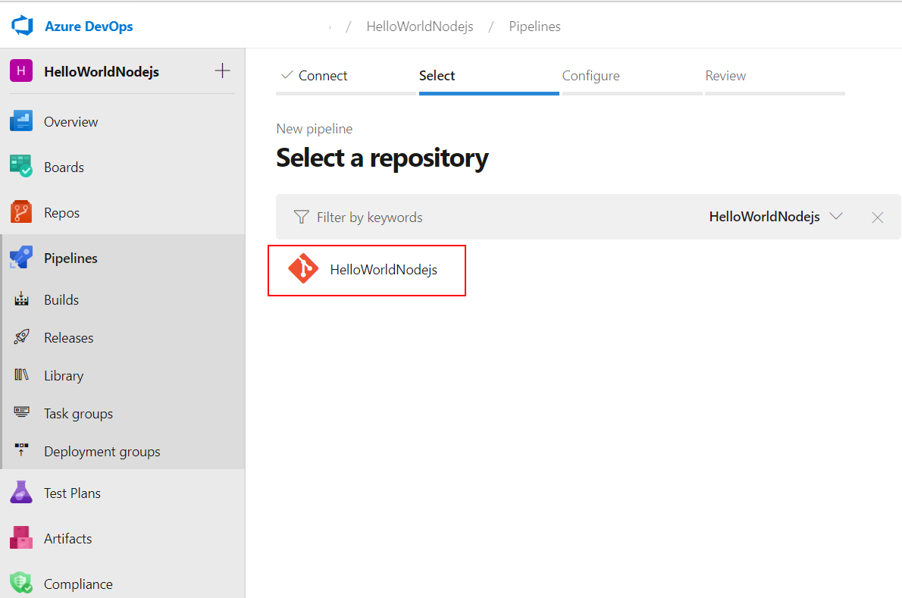
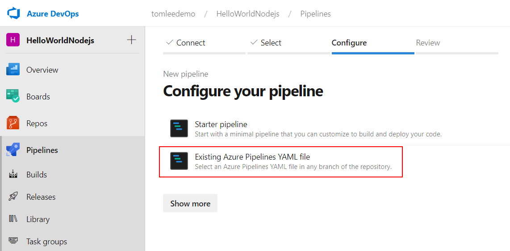
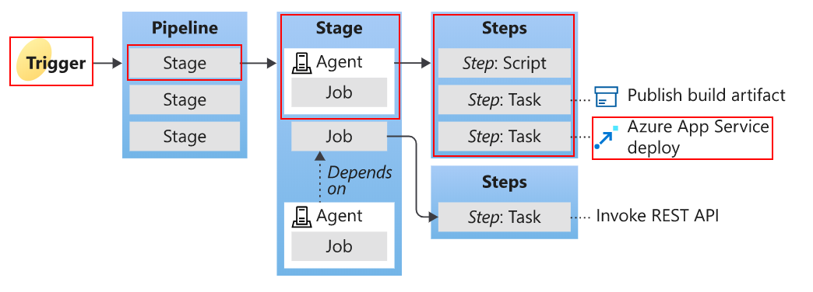
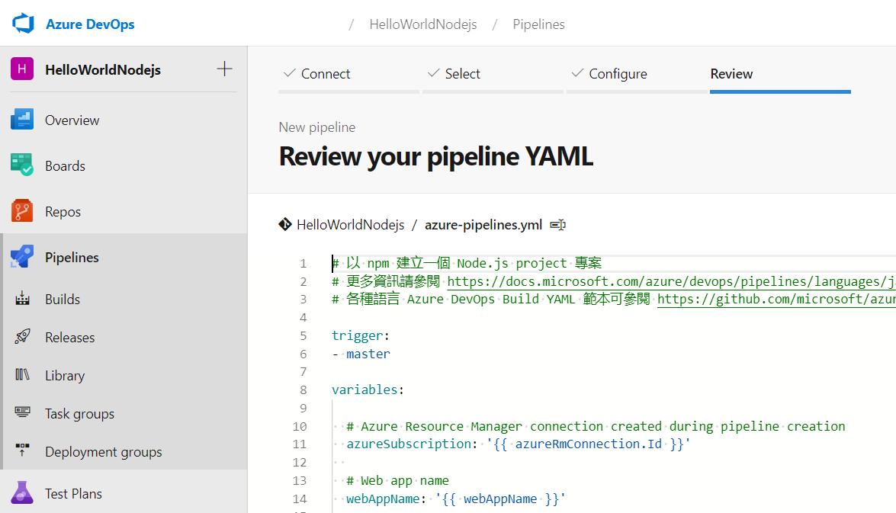
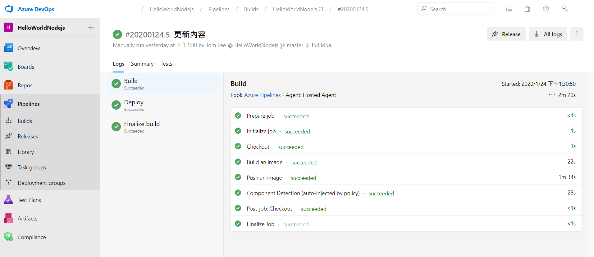
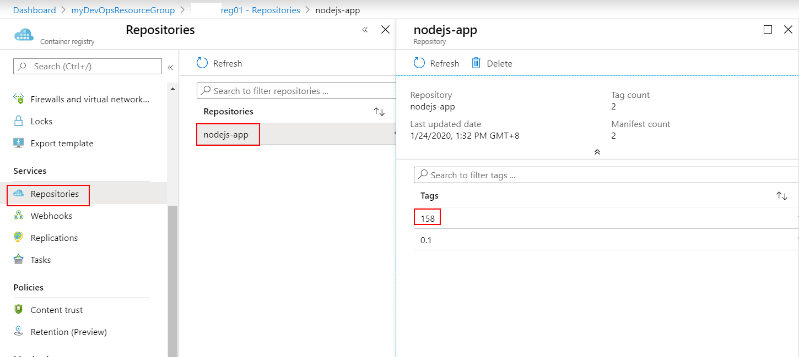

# Azure DevOps 持續整合/持續交付 (CI/CD,Continuous Integration Continuous Delivery) 功能實機操作

## Lab 6 在 Azure DevOps 內建立管線 (Pipelines) 

1.Azure DevOps Pipelines 能夠支援多種版本管控系統，將最新版本程式的建構與佈署自動化，減少人為手動參與降低出錯的機會，Azure DevOps Pipelines 支援各種程式語言的建構，本次實機練習將使用之前備妥的 Nodejs 網頁應用程式以容器形式佈署於 Azure Container Registry 與 Azure Web App for Containers Linux，將整個過程透過 Azure DevOps Pipelines 自動化，以期在持續整合/持續交付 ( CI/CD,Continuous Integration Continuous Delivery ) 過程中不再花費時間在瑣碎組態設定與人為操作細節上。

請以瀏覽器登入 https://dev.azure.com/ 進入 Azure DevOps 入口管理網站，並如圖點選左方的管線 (**Pipelines**)，並按下 **New pipeline** 按鈕準備建立一個全新的管線。



2.接著選取程式碼的來源，在本次實機練習是採用 Azure DevOps Repos 儲存庫作為程式碼版本管控系統，因此請選取圖中的 **Azure Repos Git - YAML**。

您或許會發現畫面下方有個連結 Use the classic editor to cretae a pipeline without YAML，這是 Azure DevOps Pipelines 早期以圖形使用者介面 (GUI) 提供用戶定義建構 Pipeline 的傳統編輯模式，對於初學者而言透過圖形使用者介面操作雖較簡單，但對於 Pipelines 自身版本管控不易，簡單的圖形使用者介面也無法定義複雜 Pipelines 行為，因此微軟公司建議用戶在這個時間點應該以新的 YAML 模式取代傳統模式，在過渡階段網路上會找到很多舊的資訊仍是採用傳統模式，如果用戶堅持要使用傳統模式則必須點選下方這個連結，而在本次實機練習我們將採用新的 YAML 模式。




3.接下來需要選取使用 Azure DevOps Repos 中哪一個儲存庫，如圖我們選取在 Lab 2 中已經儲存我們程式碼的 **HelloWorldNodejs** 這個儲存庫。



4.緊接著進入一個步驟，定義配置 Pipeline 的 YAML 檔案，我們可以如圖選擇 **Starter pipeline**，建立一個最簡單只會顯示 Hello, world! 的 Pipeline。



Azure DevOps Piplines 建構流程如圖所示是由 **Stage**,**Job**,**Step**,**Task** 所組合而成，當觸發條件發生時就會依據 YAML 定義的內容循序執行，對於簡單的情境可能只有單一 **Stage**，此時在 YAML 語法中可以被省略。當整個 Pipeline 執行完畢之後，產生的相關檔案可以送入 **Artifact** 保存下來，對於簡單的情境也可能直接佈署到可被執行的環境，以這次實機練習我們會直接將建立為的 Docker 容器推送到 Azure Container Registry，再從 Azure Container Registry 佈署到 Azure Web App for Containers Linux，不會有檔案放到 **Artifact**。



您可以將以下內容以剪貼方式取代原本 **Starter pipeline** 預設的 Pipeline 內容，亦可以[直接下載預先備妥之檔案使用](HelloWorldNodejs/azure-pipelines.yml)，請注意這個檔案中有兩個變數值需要替換成前面 Lab 3 與 Lab 4 所建立的內容，請修改完畢後再進入下一步驟。

```yaml
# 以 Docker Container 方式部署一個 Node.js 應用程式至 Azure Web App for Containers Linux
# 更多資訊請參閱 https://docs.microsoft.com/en-us/azure/devops/pipelines/tasks/deploy/azure-rm-web-app-deployment
# 各種語言 Azure DevOps Build YAML 範本可參閱 https://github.com/microsoft/azure-pipelines-yaml/tree/master/templates

trigger:
- master

resources:
- repo: self

variables:
  # ========================================================================
  #                          主要變數，請填入您對應的內容
  # ========================================================================

  # 變數 Azure.ResourceGroupName 值請填入您所建立的的 Azure 資源群組名稱.
  Azure.ResourceGroupName: 'myDevOpsResourceGroup'

  # 變數 Azure.ServiceConnectionId 請填入您在 Azure DevOps 內建立的 Service connections 名稱.
  Azure.ServiceConnectionId: 'MyAzureConnection'

  # 變數 Azure.Location 填入您所建立的的 Azure 資源群組名稱所在之資料中心.
  Azure.Location: 'southeastasia'

  # 變數 ACR.Name 請填入您所建立的 Azure Container Registry (ACR) 名稱.
  ACR.Name: '<您的 ACR 名稱>'
  
  # 變數 Web.Name 請填入您所建立的 Azure Web App for Containers Linux 名稱
  WebApp.Name: '<您的 Azure Web App for Containers Linux 名稱>'
  
  # 變數 ServicePlan.Name 請填入您所建立的 Azure App Service Plan 名稱
  ServicePlan.Name: 'mydevops-appserviceplan'

  # 變數 MyImageName 請填入 Docker Image 標籤名稱，未來會以 MyImageName:Build# 方式放在 ACR 內
  MyImageName: 'nodejs-app'
  # ========================================================================
  #                           衍伸變數與除錯用途設定
  # ========================================================================
  
  ACR.ImageName: '$(MyImageName):$(Build.BuildId)'
  ACR.FullName: '$(ACR.Name).azurecr.io'
  System.Debug: 'false'

jobs:
 
- job: BuildImage
  displayName: Build
  condition: succeeded()

  pool:
    vmImage: 'ubuntu-latest'

  steps:
  - task: Docker@1
    displayName: 'Build an image'
    inputs:
      azureSubscriptionEndpoint: '$(Azure.ServiceConnectionId)'
      azureContainerRegistry: '$(ACR.FullName)'
      imageName: '$(ACR.ImageName)'
      command: build
      dockerFile: '**/Dockerfile'

  - task: Docker@1
    displayName: 'Push an image'
    inputs:
      azureSubscriptionEndpoint: '$(Azure.ServiceConnectionId)'
      azureContainerRegistry: '$(ACR.FullName)'
      imageName: '$(ACR.ImageName)'
      command: push

- job: DeployApp
  displayName: Deploy
  dependsOn: BuildImage
  condition: succeeded()

  pool:
    vmImage: 'ubuntu-latest'

  steps:
  - task: AzureWebAppContainer@1
    displayName: 'Azure Web App on Container Deploy: $(WebApp.Name)'
    inputs:
      azureSubscription: '$(Azure.ServiceConnectionId)'
      appName: $(WebApp.Name)
      imageName: '$(ACR.FullName)/$(ACR.ImageName)'

```
5.如圖在最後一個步驟我們可以按下 **Save and run** 按鈕儲存此 YAML 檔案並開始排程執行。



執行結果無論成功或失敗都會被記錄在 **Auzre DevOps Pipelines**，如果一切順利應會看到如圖的畫面



以瀏覽器進入 [Azure Portal](https://portal.azure.com) 在之前所建立的 Azure Container Registry 之中應該會看到由 Azure DevOps Pipelines 剛剛推送進來的 Docker 映像檔，在我們的 YAML 檔案中會以 Pipeline 執行時流水號 BuildId 來作為 映像檔的標籤，BuildId 會是一個正整數，您環境中或許標籤內容會與畫面中不同，但可以看出跟 Lab 3 自行定義的 0.1 並存於 Azure Container Registry 內，至此代表本 Lab 已經順利完成。




* [前往練習 Lab 7](Labs-07.md)
* [返回 README](README.md)