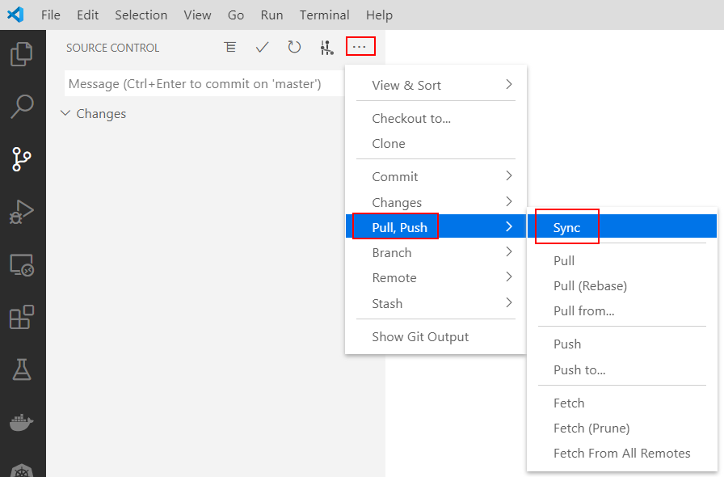

# Azure DevOps 持續整合/持續交付 (CI/CD,Continuous Integration Continuous Delivery) 功能實機操作

## Lab 7 驗證 Azure DevOps 持續整合 (Continuous Integration) 功能

1.Azure DevOps Pipelines 具備多種觸發 (Trigger) 條件，請以瀏覽器登入 https://dev.azure.com/ 進入 Azure DevOps 入口管理網站，並如圖點選左方的管線 (**Pipelines**)，接著點選 Lab 6 所建立的 **HelloWorldNodejs CI**，此時在畫面右方會出現 **Edit** 編輯按鈕，按下 **Edit** 編輯按鈕我們可以檢視與編輯此管線的內容。


2.進入編輯畫面後我們可以看到之前建立的 YAML 定義檔，此時點選畫面右方 **...** 可以顯示更多功能選項，接著請點選 **Trigger** 可以進入觸發條件設定畫面。


3.觸發條件設定畫面可以看到三種類型
* **Continuous integration** 持續整合，每次有新版本程式碼上傳都會自動觸發管線執行
* **Scheduled** 可設定固定時間觸發管線執行
* **Build completion** 當某一個管線建構執行完畢之後，才會觸發此管線

在畫面中我們可以看到目前  **Continuous integration** 持續整合的選項預設是被開啟 (**Enabled**) 的。


4.接下來我們開啟 Visual Studio Code 修改位於本機 Windows 10 環境的程式碼，以便驗證持續整合是否會自動執行。我們將原本程式碼中:

```javascript
  res.write('<h1>Hello World! </h1>');
```
修改為

```javascript
  res.write('<h1 style="color:red;">Hello World! </h1>');
```
也就是透過 Cascading Style Sheets 將 Hello World! 文字顏色變更為紅色。新版本完整程式碼如下 :

```javascript
const http = require("http");
const os = require("os");

const ipv4 = "0.0.0.0";
const port = 9876;
const computerName = os.hostname();

const server = http.createServer((req, res) => {
  res.statusCode = 200;
  res.setHeader("Content-Type", "text/html");  
  res.write('<h1 style="color:red;">Hello World! </h1>');
  res.write('from '+computerName);
  res.end();
});

server.listen(port, ipv4, () => {
  console.log(`Server running at http://${ipv4}:${port}/`);
});
```
5.如圖請在 Visual Studio Code 內點選版本管控 (Source Control) 圖示，可以看到我們剛才所修改 Nodejs 應用程式 index.js ，接著可以在文字方塊內輸入 "修改字型顏色" 作為註解，接著按下 **✓** Commit 符號即可將相關檔案納入本機 Git 儲存庫的管理。通常程式碼修改或新增功能會善用 Git 分支功能，在多人協同開發的情境中，利用 Azure DevOps Repos 的拉取請求（Pull Request）功能，讓專職負責的同仁來合併新進的程式碼進入 master 主線，而不會這樣直接修改 master 主線程式碼，但本實機練習著眼的是 Azure DevOps 持續整合/持續交付相關功能，因在此就簡化了程式碼修改的流程。


6.接下來如 Lab 2 相同之操作，請在 Visual Studio Code 內點選版本管控 (Source Control) 圖示，接著按下 **....** 符號顯示更多操作之選單，在選端單點選 **Sync** 即開始本機與雲端 Azure DevOps Repos 儲存庫間進行檔案同步。



7.此時若以瀏覽器登入 https://dev.azure.com/ 進入 Azure DevOps 入口管理網站，並左方的管線 (**Pipelines**) 就會看到此管線正在執行中，當整個管線順利執行完畢，即可進入 [Azure Portal](https://portal.azure.com) 在之前所建立的 Azure Container Registry 確認是否如圖中一樣有最新版本的 Docker 映像推送進來。


一旦看到了新版本 Docker 映像檔已經出現，接著就可以利用瀏覽器連接網址 https://<Azure Web App 名稱>.azurewebsites.net/ 
進行測試，我們應該會看到如下的畫面，新版本紅字字體的網頁應用程式已經在 Azure Web App for Containers Linux 上順利執行了。


* [刪除所建立的 Azure 資源群組](Labs-clear.md)
* [返回 README](README.md)