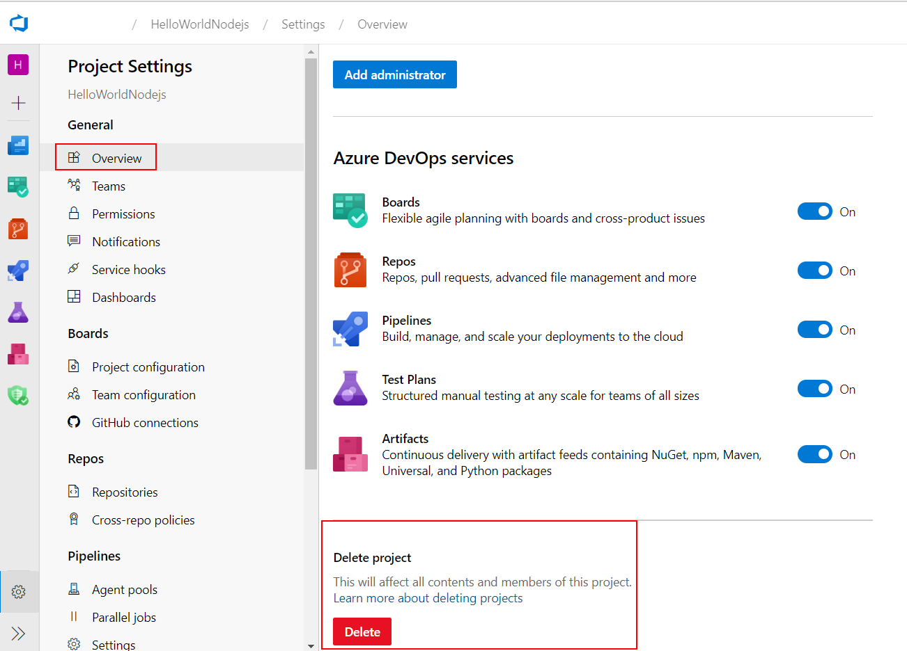

# Azure DevOps 持續整合/持續交付 (CI/CD,Continuous Integration Continuous Delivery) 功能實機操作

## 刪除 Azure Container Registry 與 Azure Web App for Conatiner - Linux 之資源群組

在命令列模式下達以下指令即會刪除之前所建立的 Azure Container Registry 與 Azure Web App for Conatiner - Linux，整個過程會花費數分鐘時間。

```powershell
az group delete -n myDevOpsResourceGroup
```

而 Azure DevOps 免費帳號不會產生任何費用，您可以保留日後繼續使用。如果您仍要刪除此專案，請以瀏覽器登入 https://dev.azure.com/ 進入 Azure DevOps 入口管理網站，並如圖點選左下方的專案設定 (**Project settings**)


接著點選 **Overview** 並將瀏覽器右方窗格捲動到尾端，即可看見如圖所示的 **Delete** 專案刪除按鈕，按下此按鈕並確認後即會刪除本次練習的專案。




* [返回 README](README.md)
