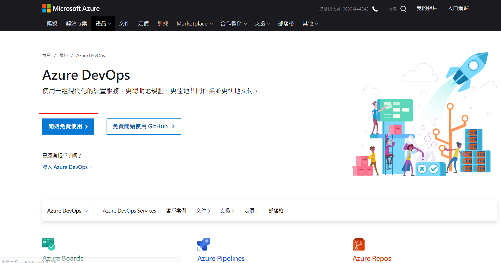

# Azure DevOps 持續整合/持續交付 (CI/CD,Continuous Integration Continuous Delivery) 功能實機操作

此實機操作練習是以 Windows 10 用戶運用 Azure DevOps 進行持續整合/持續交付 (CI/CD) 之情境所設計，並以 Microsoft Azure 相關容器服務作為練習的平台。在此實機練習中，我們會使用一個 Nodejs 網頁應用程式，以 Docker 容器形式佈署於 Azure Container Registry 與 Azure Web App for Containers Linux，並透過 Azure DevOps Pipelines 讓整個過程自動化。請注意此系列操作練習目的在於體驗 CI/CD 概念，相關組態配置並非考量真實營運環境的最佳架構。

在練習過程中使用 Azure App Service Web App for Containers Linux 基本服務方案 B1 等級規格，每一個執行個體每小時產生 NT$0.91 費用，每月產生約 NT$593 費用，Azure Container Regisrty 基本版則是每月產生約 NT$155 費用，實機練習完畢後如果將相關 Azure 資源刪除就不再產生任何費用，假若練習兩小時完畢後刪除所有內容，產生費用約 NT$7。而 Azure DevOps 無須信用卡即可擁有 5 位用戶免費使用並提供每月 1,800 分鐘 CI/CD 免費建構時數，因此在整個實機練習過程 Azure DevOps 將不會有費用產生。

## Azure DevOps 相關資源
* [Azure DevOps 首頁與免費帳號申請](https://azure.microsoft.com/zh-tw/services/devops/)
* [Azure DevOps 文件首頁](https://docs.microsoft.com/zh-tw/azure/devops/)
* [Azure DevOps Labs](https://www.azuredevopslabs.com/)
* [DevOps Resource Center](https://docs.microsoft.com/zh-tw/azure/devops/learn/)
* [為你自己學 Git](https://gitbook.tw/)

## Docker 與 Microsoft Windows 相關資源
* [Docker - 從入門到實踐正體中文版](https://philipzheng.gitbooks.io/docker_practice/content/)
* [Docker Hub](https://hub.docker.com/)
* [Windows 上使用容器文件首頁](https://docs.microsoft.com/zh-tw/virtualization/windowscontainers/)

## Azure Container Registry
* [Azure Container Registry 文件首頁](https://docs.microsoft.com/zh-tw/azure/container-registry/)

## Azure Web App for Containers - Linux 相關資源
* [Linux 上的 Azure App Service 官網文件](https://docs.microsoft.com/zh-tw/azure/app-service/containers/)

## Lab 0 準備工作，安裝 Docker Desktop for Windows
* 備妥 Windows 10 64 位元專業版，企業版或教育版 (Build 15063 之後版本)，家用版因為不支援 Hyper-V 無法使用
* BIOS 與 Windows 需啟用 Hyper-V 虛擬化環境
* 至 Docker Hub [註冊帳號並且下載](https://hub.docker.com/editions/community/docker-ce-desktop-windows) Docker Desktop for Windows(stable) 版本
* 執行安裝程式，安裝完畢後 Windows 工作列會顯示 Docker 圖示點選可進行相關設定

* 本實作練習採用 Linux 容器，啟用 Hyper-V 管理員可以看到 Docker Desktop for Windows 所建立的 Linux 虛擬機器

## 其他所需工具
* 下載安裝 [Visual Studio Code](https://code.visualstudio.com/Download) Windows 64 bit 版本
* 下載安裝 [Git for Windows](https://gitforwindows.org/) ，Visual Studio Code 內建之 Git 延伸模組必須搭配 Git 2.0 以上版本
* 下載安裝 [Nodejs 12.xx](https://nodejs.org/zh-tw/download/) Windows 64 bit 版本

## Azure DevOps 免費帳號
* 請至 [Azure DevOps 首頁](https://azure.microsoft.com/zh-tw/services/devops/)，點選申請免費帳號，Azure DevOps 無須信用卡即可取得免費帳號。

## Lab 3 之後會使用到 Microsoft Azure，需準備妥
*  Microsoft Azure [訂閱帳號](https://azure.microsoft.com/zh-tw/free/)
* 下載安裝 [Azure CLI 2.0.80](https://docs.microsoft.com/zh-tw/cli/azure/install-azure-cli?view=azure-cli-latest) 之後版本 

## Lab 1 - Lab 7 內容說明
* [前往練習 Lab 1](Labs-01.md) : 在 Azure DevOps 內建立組織 (Organization) 與專案 (Project)
* [前往練習 Lab 2](Labs-02.md) : 在 Azure DevOps 內建立儲存庫 (Repos) 並加入程式碼
* [前往練習 Lab 3](Labs-03.md) : 建立 Azure Container Registry 並推送 Docker 映像檔
* [前往練習 Lab 4](Labs-04.md) : 建立 Azure Web App for Containers Linux
* [前往練習 Lab 5](Labs-05.md) : 在 Azure DevOps 內建立服務連線 (Service connections)
* [前往練習 Lab 6](Labs-06.md) : 在 Azure DevOps 內建立管線 (Pipelines) 
* [前往練習 Lab 7](Labs-07.md) : 驗證 Azure DevOps 持續整合 (Continuous Integration) 功能
* [刪除所建立的 Azure 資源群組](Labs-clear.md)
